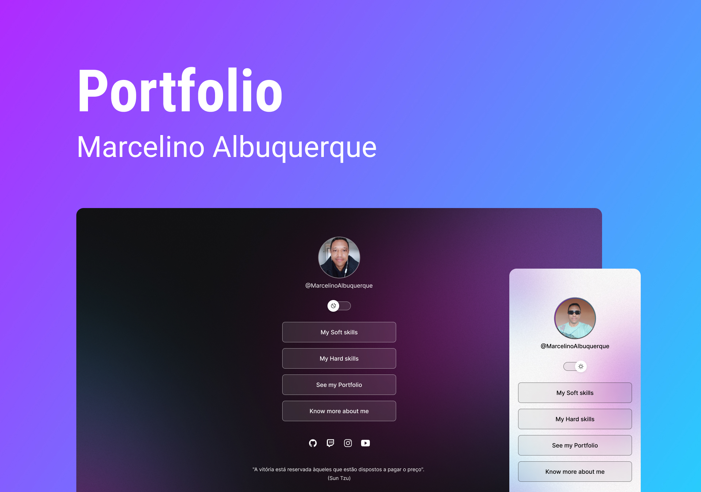

<h1 align="center"> My Portifolio </h1>

Projeto desenvolvido com o objetivo de expor de forma dinâmica meus conhecimentos na programação FrontEnd.  
<a href="https://lp.rocketseat.com.br/devlinks/inscricao?utm_source=github&utm_medium=descricao&utm_campaign=capture-devlinks&utm_term=organic&utm_content=descricao-github-mayk-brito">Estude esse projeto em formato de vídeo clicando aqui.</a>

  <a href="#-tecnologias">Tecnologias</a>&nbsp;&nbsp;&nbsp;|&nbsp;&nbsp;&nbsp;
  <a href="#-projeto">Projeto</a>&nbsp;&nbsp;&nbsp;|&nbsp;&nbsp;&nbsp;
  <a href="#-layout">Layout</a>&nbsp;&nbsp;&nbsp;|&nbsp;&nbsp;&nbsp;
  <a href="#memo-licença">Licença</a>

  

 

  

## 🤖 Tecnologias

O presente projeto de Portifólo foi desenvolvido usando as seguintes tecnologias:

- HTML e CSS
- JavaScript
- Git e Github
- Figma

## 👨‍💻 Projeto

Este Portfólio é um agregador de links que serve como um Business Card online.

- [Acesse o projeto finalizado, online](####)

- [Conheça outros Projetos](https://github.com/Marcelino85)

## 🔖 Layout

Você pode visitar meu Figma [NESSE LINK](https://www.figma.com/@marcelinoalbuqu). É necessário ter conta no [Figma](https://figma.com) para acessá-lo.

---

"A vitória está reservada àqueles que estão dispostos a pagar o preço".  
(Sun Tzu)
